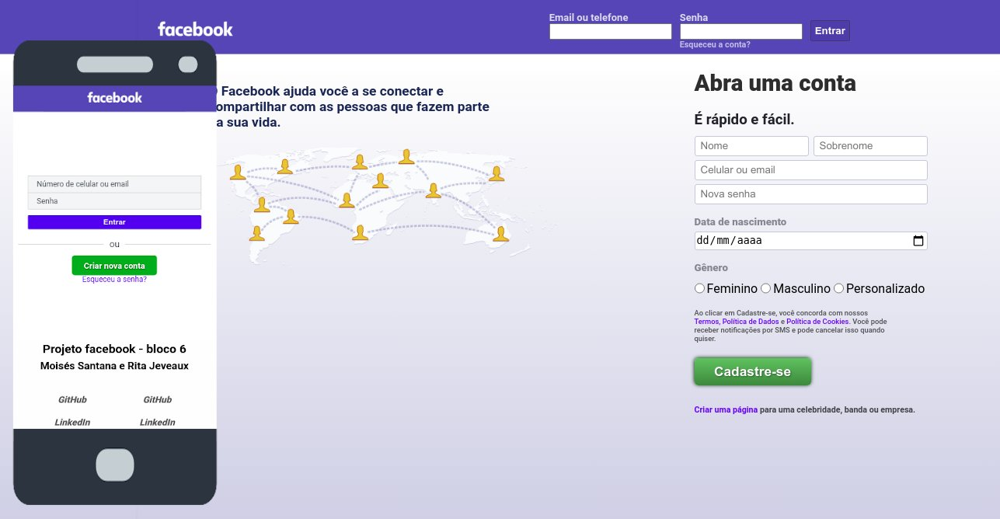

# Esse projeto é para fins educativos, não tem ligação alguma com o a empresa facebook.

# Projeto rede-social signup

A Trybe passou como projeto em dupla a construção da página de login do facebook, onde tivemos que recriar a página de login e colocar algumas funcionalidades como, após preencher os campos de cadastro e dar submit ele ser substituído pelos dados preenchidos no campo de cadastro, em caso de campo vazio apresentar uma mensagem de erro e também após preencher o campo de login e clicar em entrar será aparecer uma mensagem com o texto que preencheu o campo "Email ou telefone".

#### Imagem do projeto:

## Técnologias utilizadas:

* HTML5
* CSS3
* JavaScript

### Visualize e interaja com a página signup da rede-social aqui:

https://moisessantana.github.io/facebook-singup/

#### Imagem de terceiros:

Imagem do smartphone <a href="https://www.flaticon.com/free-icon/smartphone_977258" title="prettycons">prettycons</a> from <a href="https://www.flaticon.com/" title="Flaticon"> www.flaticon.com</a>
